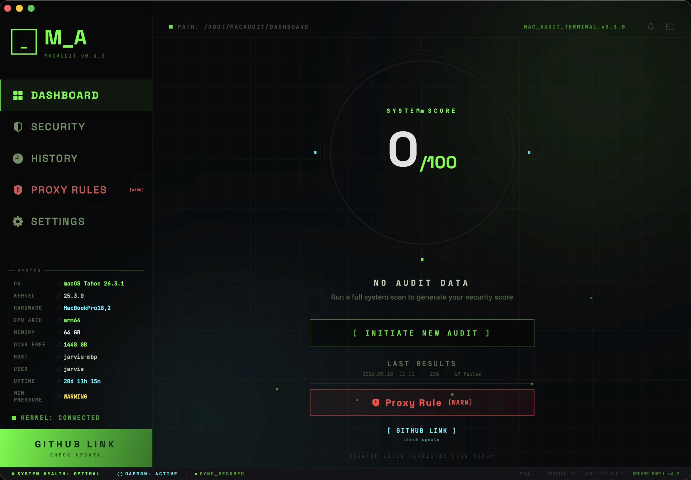
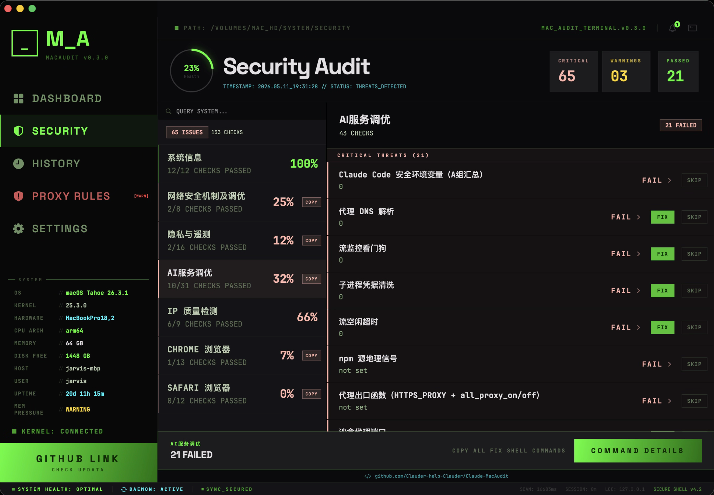
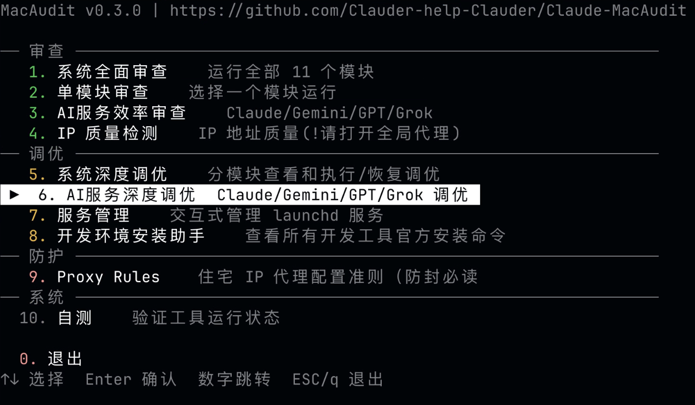

<div align="center">

# MacAudit

**Comprehensive macOS Security Audit & Optimization Toolkit**

[](https://swift.org)
[](https://www.apple.com/macos)
[](LICENSE)
[](#testing)
[](#compatibility)

[English](README.md) · [中文](README_CN.md)

</div>

---

MacAudit is a native macOS system security audit and optimization tool built in **Swift 6 with strict concurrency**. It performs **400+ automated checks** across 12 audit modules, covering security hardening, privacy protection, network configuration, performance tuning, and AI service compatibility — all with **zero third-party runtime dependencies**.

> **From Python script to Swift native app — 1 month, 5 milestones, 5 rounds of expert audits, 720+ tests, and real-machine validation across two macOS generations.**

> **Latest releases, test reports, and upgrade notes are published on [GitHub](https://github.com/Clauder-help-Clauder/Claude-MacAudit).**

---

> **Note**: Due to platform policy restrictions, this software uses "AI Network & System Optimization" as an alias for certain protection features.

## Special Thanks

<a href="https://wstormai.store/"></a>

**Subscription top-up powered by [wstormai](https://wstormai.store/)**

Reliable Claude/Codex subscription channel throughout the entire development and testing period.

<br clear="left">

---

## What's New

Latest 5 releases. Full history: [Releases](https://github.com/Clauder-help-Clauder/Claude-MacAudit/releases) · [CHANGELOG](CHANGELOG.md).

| Version | Date | Highlights | Release |
|---------|------|------------|---------|
| **v0.3.1** | 2026-05-12 | Codex / OpenAI account protection (3 new A0 checks), AIBrands extensible architecture, iCloud subscription recommendation | [→ v0.3.1](https://github.com/Clauder-help-Clauder/Claude-MacAudit/releases/tag/v0.3.1) |
| v0.3.0 | 2026-05-11 | Stable release — idempotent fixes (sed delete-then-append), verified execution, security hardened, 10-round VM stability | [→ v0.3.0](https://github.com/Clauder-help-Clauder/Claude-MacAudit/releases/tag/v0.3.0) |

---

## Table of Contents

- [Why MacAudit?](#why-macaudit)
- [CLI vs. GUI](#cli-vs-gui)
- [Audit Modules](#audit-modules)
- [Quick Start](#quick-start)
- [Architecture](#architecture)
- [Priority System](#priority-system)
- [Testing](#testing)
- [Development Journey](#development-journey)
- [Expert Audits & Code Review](#expert-audits--code-review)
- [Research & References](#research--references)
- [Compatibility](#compatibility)
- [Roadmap](#roadmap)
- [Acknowledgments](#acknowledgments)
- [Contributing](#contributing)
- [License](#license)

---

## Screenshots

### GUI

<p>

</p>

<p>

</p>

### CLI

<p>

</p>

---

## Why MacAudit?

- **Exhaustive Coverage** — 400+ checks across 12 modules, from kernel sysctl tuning to browser policy inspection
- **Safe by Design** — Every fix command is validated by `UndoValidator` with a whitelist mechanism; rollback scripts are generated automatically with `0o700` permissions
- **macOS Version Aware** — Handles format differences between Sequoia (15.x) and Tahoe (26.x), including `defaults -bool` normalization via `DefaultsNormalizer`
- **Dual Interface** — CLI for full-detection workflows; GUI for streamlined core-check dashboards
- **Zero Dependencies** — Built entirely on Apple SDKs and Swift Package Manager; no Homebrew, no CocoaPods, no Carthage
- **Battle-Tested** — Validated on real hardware and VMs across Apple Silicon and Intel, macOS 15 and macOS 26, with adversarial, mutation, chaos, and concurrency testing

> **MacAudit is the only Swift-native macOS security audit tool on GitHub**, and the only tool that combines comprehensive macOS system auditing with AI service protection in a single package. No other tool covers this intersection.

> 💡 **Account hygiene tip** — Fresh macOS install + iCloud-based Claude/Codex subscription (App Store IAP) removes your credit card from the risk chain. Apple adds a ~30% surcharge, but eliminates bank chargeback and fraud labels that commonly cascade into AI account bans. See [`docs/proxy_rules.md`](docs/proxy_rules.md#账号注册最佳实践账号层防护) for the full rationale.

## CLI vs. GUI

| | CLI (`macaudit`) | GUI (`MacAuditApp`) |
|---|---|---|
| **Scope** | **Full Detection** — All 400+ checks across 12 modules | **Core Detection** — A0-priority critical checks (~85 items across 6 modules) |
| **Interface** | Terminal (ANSI color, interactive menu) | Native SwiftUI window with cyberpunk design system |
| **Use Case** | Power users, automation, CI/CD, scripting | Quick health check, visual overview |
| **Fix Support** | `--fix` / `--undo` with rollback scripts | View-only (fixes via CLI) |
| **Export** | JSON, Markdown, baseline diff | In-app dashboard |
| **Default Run** | A0 priority only; `--all` for full scan | A0 critical checks automatically |

## Audit Modules

| # | Module | Checks | Description |
|---|--------|--------|-------------|
| 1 | SystemInfo | 12 | Hardware, OS version, architecture, uptime |
| 2 | NetworkSecurity | 44 | Firewall, DNS, sysctl tuning, socket filters |
| 3 | Privacy | 17 | Telemetry, analytics, data collection opt-out |
| 4 | Animation | 43 | UI animation toggles for performance/responsiveness |
| 5 | Services | 70+ | Daemon status, launch agents, system services |
| 6 | Power | 21+ | Sleep, Power Nap, battery optimization |
| 7 | Shell | 19 | Terminal environment, PATH, shell configuration |
| 8 | ClaudeProtection | 53 | AI service compatibility (Claude Code, Codex, etc.) |
| 9 | DevEnvironment | 66 | Xcode, Homebrew, Git, language runtimes |
| 10 | IPQuality | 23 | DNSBL reputation, GeoIP, mail blacklists |
| 11 | Chrome | 13 | Chrome policies, updates, telemetry |
| 12 | Safari | 14 | Safari security, privacy, auto-fill policies |

## Quick Start

### Prerequisites

- macOS 15.0 (Sequoia) or later
- Xcode 16.0+ with Swift 6.0 toolchain
- Apple Silicon (M-series) or Intel x86_64

### Build from Source

```bash
git clone https://github.com/Clauder-help-Clauder/Claude-MacAudit.git
cd Claude-MacAudit/MacAudit
swift build -c release
```

### Run the CLI (Full Detection)

```bash
# Interactive menu (default: A0 priority only)
.build/release/MacAudit

# Full detection across all 12 modules, all priorities
.build/release/MacAudit --all

# Audit a specific module
.build/release/MacAudit --module privacy

# Export results as JSON
.build/release/MacAudit --all --json --export report.json

# Save baseline and diff against it later
.build/release/MacAudit --all --save baseline.json
.build/release/MacAudit --all --diff baseline.json

# Apply fixes (generates rollback script automatically)
.build/release/MacAudit --all --fix

# Undo previous fixes
.build/release/MacAudit --undo

# Self-test (verify all modules load correctly)
.build/release/MacAudit --self-test
```

### Build the GUI App (Core Detection)

```bash
cd MacAudit
bash scripts/build_app.sh
# Output: release/MacAuditApp-v0.x.x.app (Universal Binary)
```

## Architecture

```
MacAudit/
├── Package.swift                    # SPM manifest (Swift 6, macOS 15+)
├── Sources/
│   ├── MacAudit/                    # CLI executable (full detection, 400+ checks)
│   │   ├── MacAudit.swift           # @main entry point + ArgumentParser
│   │   ├── CLI/                     # Menu, reports, fix engine, baseline
│   │   ├── Models/                  # AuditCheck, AuditResult, RiskLevel...
│   │   ├── Modules/                 # 12 audit modules (internal access)
│   │   ├── IPQuality/               # DNSBL, GeoIP, IP reputation (CLI copies)
│   │   └── Utils/                   # Shell execution, ANSI colors, normalization
│   ├── MacAuditCore/                # Shared framework (public API)
│   │   ├── Models/                  # Public model counterparts
│   │   ├── Modules/                 # 12 audit modules (public access)
│   │   ├── IPQuality/               # Full IP quality suite (7 files)
│   │   └── ShellExecutor.swift      # Actor-based shell command runner
│   ├── MacAuditUI/                  # SwiftUI interface (core detection, ~85 A0 checks)
│   │   ├── App/                     # Entry point factory
│   │   ├── Views/                   # Dashboard, scanning, results, detail
│   │   ├── ViewModels/              # Observable audit state + notification center
│   │   ├── DesignSystem/            # Tokens + reusable components
│   │   └── Resources/               # Fonts (Space Grotesk, JetBrains Mono)
│   └── MacAuditApp/                 # Thin launcher → MacAuditUI
└── Tests/
    └── MacAuditTests/               # 38 test files, 720+ test cases
```

### Key Components

| Component | Description |
|-----------|-------------|
| **ShellExecutor** | `actor`-based subprocess runner with timeout, `readabilityHandler` pipe management, and Swift concurrency safety |
| **FixEngine** | Generates, validates, and applies fix commands; produces undo scripts with `0o700` permissions; `shellEscape` defense against injection |
| **UndoValidator** | Whitelist-based safety gate: only `defaults/networksetup/sysctl/pmset/launchctl/PlistBuddy` prefixes allowed; `chainingChars` detection rejects `&\|;$` injection |
| **DefaultsNormalizer** | Handles `defaults -bool` format differences (`YES/NO` on Tahoe vs `1/0` on Sequoia) at the comparison layer |
| **IPCache** | `@unchecked Sendable class` with `OSAllocatedUnfairLock` thread-safe TTL cache for DNSBL/GeoIP results; eliminates 60%+ redundant network calls |
| **BaselineManager** | Save audit snapshots, diff against previous runs to track configuration drift |
| **AuditNotificationCenter** | `@MainActor @Observable` notification system with severity levels (info/warning/critical), 50-item cap, O(1) unread count cache |

## Priority System

Every check is assigned a priority level based on cross-referencing 9 research documents and 49 cross-document findings:

| Priority | Label | Count | Description |
|----------|-------|-------|-------------|
| A0 | Critical | ~83 | Security vulnerabilities, data leaks, AI service safety — always included |
| A1 | High | ~43 | Performance impact, noticeable misconfiguration |
| A2 | Medium | ~115 | Cosmetic preferences, minor optimization |
| A3 | Low | ~155 | Niche settings, advanced tuning, pure information |

- **Default CLI run** (`macaudit`) executes A0 checks only
- **Full CLI run** (`macaudit --all`) covers A0–A3 across all 12 modules (400+ checks)
- **GUI** focuses on A0 critical checks for quick health overview (~85 items across 6 modules)

## Testing

### Test Suite Overview

| Category | Count | Description |
|----------|-------|-------------|
| **Unit Tests** | 720+ | All 12 modules, FixEngine, UndoValidator, ShellExecutor, IPCache, AppViewModel, AuditNotificationCenter |
| **Integration Tests** | 400-check × 3 rounds | Cross-module consistency on real macOS |
| **Fix-Roundtrip** | 10/10 PASS | break → detect → fix → verify closed loop |
| **Adversarial Testing** | 17/20 detected (85%) | Deliberately misconfigure 20 security settings |
| **Mutation Testing** | 15/15 (0 crashes) | 15 types of abnormal values injected |
| **Idempotency** | 3/3 PASS | Fix command executed twice produces same result |
| **Chaos Engineering** | 5/5 PASS | locale, PATH, HOME, concurrency, consistency |
| **Baseline Recovery** | 0 diff | All tests end with system fully restored |

### Testing Methodology

We researched and adapted **7 innovative testing methods** from industry best practices:

| Method | Source Inspiration | Implementation | Test Points |
|--------|-------------------|----------------|-------------|
| Adversarial Testing | [Lynis](https://github.com/CISOfy/lynis) + [claudit-sec](https://github.com/nicholasaleks/claudit) | T2: Deliberately break 20 security configs | 20 |
| Fix-Roundtrip | [NIST mSCP](https://github.com/usnistgov/macos_security) atomic actions | T3: break→detect→fix→verify loop | 10 |
| Mutation Testing | [Google Santa](https://github.com/google/santa) config-override | T4: 15 types of abnormal value injection | 15 |
| Idempotency Testing | [osquery](https://github.com/osquery/osquery) property-based | T5: Run same fix twice | 3 |
| Chaos Engineering | Netflix Chaos Monkey | T6: locale/PATH/HOME/concurrency | 5 |
| Snapshot Comparison | [swift-argument-parser](https://github.com/apple/swift-argument-parser) | T1+T7: 3-round consistency + recovery | 6 |
| Concurrency Testing | [osquery](https://github.com/osquery/osquery) concurrent queries | T6-4/5: Multi-instance parallel | 2 |

### Real Machine Test — macOS 26.4.1 Tahoe (Intel x86_64)

**Environment**: `<testuser>@<test-machine>`, Darwin 25.4.0, x86_64, MacAudit v0.1.5

| Test Category | Result |
|---|---|
| T1: 397-check × 3 rounds | **0 diff** (perfect consistency) |
| T2: Adversarial (20 breaks) | **17/20 detected** (100% excluding Chrome MDM limitation) |
| T3: Fix-Roundtrip | **10/10 PASS** |
| T4: Mutation (15 abnormal values) | **15/15 OK** (0 crashes) |
| T5: Idempotency | **3/3 PASS** |
| T6: Chaos (5 scenarios) | **5/5 PASS** |
| T7: Final baseline recovery | **0 diff** (fully restored) |
| **Total** | **7 categories, 70 test points, 100% pass rate** |

Key discoveries from adversarial testing:
- **Cross-module detection**: Privacy module changes to SubmitDiagInfo/CrashReporter were simultaneously caught by Claude module's `telemetry_*` checks
- **Cascade effects**: Safari UniversalSearchEnabled change triggered Privacy's `safari_search` detection
- **Chrome architectural limitation**: Non-MDM environments cannot influence Chrome audit results (expected, documented)

## Development Journey

MacAudit evolved from a simple Python audit script into a full-featured native macOS application over the course of approximately one month.

### Timeline

```
2026-04-06  Project inception — Python audit scripts + optimization guides
            ├── mac_audit.sh (shell audit collector)
            ├── Mac_System_Optimization_Guide.md (security hardening)
            └── Surge_Optimization_Guide.md (proxy config)

2026-04-07  Claude Protection research — 6-layer defense guide v1.0→v1.1
            ├── Claude_Protection_Guide.md
            ├── Claude_Protection_Audit.md (8-dimension 40+ item audit)
            └── Claude_Protection_Research.md (GitHub Issues + community research)

2026-04-13  Philosophy shift v0.1.3→v0.1.4
            ├── "Disappearance strategy" → "Integration strategy"
            ├── Disabling telemetry = HIGH ban risk + paid feature loss
            └── hosts blocking bypassed by API-level Attribution Headers

2026-04-19  Swift rewrite begins — MacAudit 1.0 in Swift
            ├── Package.swift with 4 SPM targets
            ├── 12 audit modules with AuditModule protocol
            └── Dual-copy architecture (CLI + Core framework)

2026-04-20  Triple Expert Audit Round 2 — 3 new expert personas
            ├── Expert A: Cryptographer (Data Integrity)
            ├── Expert B: Systems Engineer (Resource Lifecycle)
            └── Expert C: UX Anthropologist (User-Facing Correctness)

2026-04-22  M1: macOS 15 VM full test
            ├── 400-check × 3 rounds consistency
            ├── 573 fixCommand verified
            └── First comprehensive test baseline

2026-04-23  M2: Tahoe 26 VM full test
            ├── 400-check × 3 rounds (100% consistent)
            ├── 336 fixCommand × 3 rounds
            ├── 492 XCTest all passing
            └── Discovered 3 macOS 26 breaking changes

2026-04-23  M3: Tahoe 26 supplementary test
            └── 169 additional tests for edge cases

2026-04-24  M4: Tahoe 26 compatibility fix (9 commits, 89 files, +3,190/-889 lines)
            ├── DefaultsNormalizer — fixed 93 Animation false positives
            ├── FixEngine undo enhancement — PlistBuddy + compound commands
            ├── Safari popup_block split — undo correctness
            └── PrivacyModule dual-copy unification
            Result: Safari 0%→93%, Animation 0%→93%, Privacy 29%→94%

2026-04-24  Real machine validation — macOS 26.4.1 Tahoe (Intel)
            └── 7 categories, 70 test points, 100% pass rate

2026-04-29  M5: GUI improvements + A0 security TDD iteration
            ├── AppViewModel test coverage (38 tests)
            ├── AuditNotificationCenter (severity levels + 50-item cap)
            ├── IPCache optimization (OSAllocatedUnfairLock, 6-11% speedup)
            ├── 6 A0 security defects fixed via TDD
            │   ├── FixEngine shell injection defense
            │   ├── UndoValidator whitelist mechanism
            │   ├── ShellExecutor pipe deadlock fix
            │   ├── FixHistory non-atomic write fix
            │   ├── IPv4Validator unified (octal ambiguity defense)
            │   └── AppViewModel executeCommand result tracking
            └── 3-round code review: fixed 3 CRITICAL + 5 WARNING

2026-05-01  Full priority drift fix + AuditCheck default safety
            ├── 12 modules MacAudit↔MacAuditCore priority sync (183 AuditCheck)
            ├── AuditCheck.init default .a0→.a3 (prevents silent A0 promotion)
            ├── GeoIP datacenter detection enhancement (dual API OR logic)
            ├── 10 new ModulePriorityConsistencyTests
            └── 3-round review: R1(4 CR), R2(2 CR), R3(full PASS)

2026-05-05  Dual-platform performance benchmark
            ├── macOS 15 VM: full scan ~10s, ip_quality cache 7.4s→6.6s (11%)
            └── macOS 26 VM: full scan ~10.4s, ip_quality cache 6.9s→6.5s (6%)
```

### By the Numbers

| Metric | Value |
|--------|-------|
| Development duration | ~30 days (Apr 6 – May 5, 2026) |
| Languages used | Python (v1.0) → Swift 6 (v0.1.x) |
| Total milestones | 5 (M1–M5) |
| Audit module count | 12 |
| Total check items | 400+ |
| Unit tests | 720+ |
| Expert audit rounds | 15+ (5 experts × 5 rounds + 3 experts × 2 rounds + 5 experts × 3 rounds) |
| Total expert findings | 180+ (across all audit rounds) |
| Commits in M4 alone | 9 (89 files, +3,190/-889 lines) |
| Real machine test points | 70 (100% pass) |
| Fix-Roundtrip verified | 10/10 PASS |
| Mutation test cases | 15 (0 crashes) |
| Adversarial detection rate | 85% (100% excluding Chrome MDM limitation) |
| Cross-platform verified | macOS 15 (arm64 + x86_64 VM) + macOS 26 (arm64 VM + x86_64 real) |

### Key Design Decisions

| Decision | Choice | Rationale |
|----------|--------|-----------|
| AuditCheck.init default priority | `.a3` (not `.a0`) | Prevents 104+ items from silently becoming A0 critical due to missing `priority:` field |
| shellEscape strategy | Reject (not filter) | Filtering lists are hard to exhaust; macOS has many shell variants; comment-based rejection is zero-risk |
| ShellExecutor pipe reading | `readabilityHandler` + accumulator | `readDataToEndOfFile` blocks thread, ignores Task cancellation, can deadlock on timeout |
| IPv4 validation | Unified `IPv4Validator` enum | Dispersed logic drifts to inconsistency; leading zeros cause octal ambiguity in DNSBL reverse lookups |
| IPCache concurrency | `@unchecked Sendable class` + lock (not actor) | Actor requires `await` on every access; lock contention is near-zero for ~100ns reads |
| ip_quality Phase B/C/D | Three-way `async let` parallel | Phase C (DNSBL) and D (mail ports) don't depend on B's results; different I/O channels |
| Claude protection philosophy | Integration, not disappearance | Disabling telemetry triggers Bayesian risk scoring; hosts blocking bypassed by API-level Attribution Headers |

## Expert Audits & Code Review

MacAudit has undergone multiple rounds of expert-level code review, making it one of the most thoroughly audited tools in its category.

### Penta Expert Audit (5 Experts × 5 Rounds)

| Expert | Persona | Focus Area |
|--------|---------|------------|
| Expert 1 | Steve Krug (UX) | Don't Make Me Think — usability, discoverability, error recovery |
| Expert 2 | Robert C. Martin (Clean Code) | Clean Code — naming, functions, SRP, DRY, error handling |
| Expert 3 | Don Norman (Design) | Design of Everyday Things — affordances, signifiers, feedback, mapping |
| Expert 4 | Edsger Dijkstra (Logic) | Structured Programming — correctness proofs, invariant maintenance, edge cases |
| Expert 5 | Kent Beck (TDD) | Test-Driven Development — red-green-refactor, test coverage, regression safety |

**25 individual reviews + 4 synthesis reports = 29 documents total**

### Triple Expert Audit Round 2 (3 Experts × Multiple Cycles)

| Expert | Persona | Focus Area |
|--------|---------|------------|
| Expert A | The Cryptographer | Data integrity, boundary conditions, encoding, JSON edge cases, regex correctness |
| Expert B | The Systems Engineer | Resource lifecycle, async correctness, file descriptor leaks, Task cancellation |
| Expert C | The UX Anthropologist | User-facing correctness, locale behavior, accessibility, error message clarity |

**Exit condition**: 3 consecutive cycles with ZERO findings across all experts.

### M4 Work Plan Review (5 Experts × 3 Rounds)

| Expert | Focus |
|--------|-------|
| Dr. Elena (Security) | Injection risks, data integrity |
| Kenji (Compatibility) | Cross-version behavior, format differences |
| Sarah (Architecture) | Dual-copy consistency, comparison engine |
| Raj (Coverage) | Test gaps, zero-coverage modules |
| Marcus (Reliability) | Undo safety, timeout handling |

**21 findings** (6 CRITICAL, 9 HIGH, 4 MEDIUM, 2 LOW) — all resolved before M4 execution.

### Iterative TDD Review Cycles

Every major feature undergoes 3-round code review:

| Round | Focus |
|-------|-------|
| Round 1 | Architecture, security, correctness |
| Round 2 | Edge cases, dual-copy consistency, regression |
| Round 3 | Final verification, zero-defect confirmation |

## Multi-Model AI Collaboration

> **MacAudit is an AI-native project — the entire software, from the first line of Python to 720+ Swift tests, was built through AI token consumption across hundreds of sessions over ~30 days. No human wrote production code directly.**

Six frontier AI models collaborated across the full development lifecycle, each contributing unique strengths:

| Model | Provider | Role in MacAudit Development |
|-------|----------|------------------------------|
| **Claude Opus 4.7** | Anthropic | Primary architect & implementer — code writing, TDD iteration, 3-round code review cycles |
| **Claude Opus 4.6** | Anthropic | Architecture planning, complex refactoring (dual-copy sync, priority drift fix) |
| **Claude Sonnet 4.6** | Anthropic | Fast iteration loops, test writing, quick verification passes |
| **GPT 5.5** | OpenAI (Codex) | Cross-validation review — scored quality gates via Rubrics for plan & code review |
| **Gemini 3.1 Pro** | Google | Creative brainstorming, design inspiration, alternative solution exploration |
| **GLM 5.1** | Zhipu AI | VM-based testing & validation (GLM_VM_Audit), macOS 15 + Tahoe 26 cross-platform verification |

### AI Development by the Numbers

| Metric | Value |
|--------|-------|
| Total development duration | ~30 days |
| AI models used | 6+ |
| Estimated total tokens consumed | **~1.3B+** input/output + **~8B+** cache (across all models and sessions) |
| AI-generated lines of code | 10,000+ (production + tests) |
| AI-generated test cases | 720+ |
| AI-conducted expert audit rounds | 15+ |
| AI-discovered bugs & findings | 180+ |

This multi-model approach provided natural cross-validation: each model independently identified issues that others missed. The `PENTA_EXPERT_AUDIT/` and `TRIPLE_EXPERT_AUDIT_R2.md` documents capture this collaborative review process. Models also served as each other's quality gates — Codex scored Claude's plans via Rubrics, Gemini provided creative alternatives, and GLM validated results on real VMs.

## Research & References

All reference documents are organized in [`docs/references/`](docs/references/). Below is the complete catalog.

### Internal Research Documents

| # | Category | Document | Description |
|---|----------|----------|-------------|
| 1 | Security | [Mac_System_Optimization_Guide.md](docs/references/security/Mac_System_Optimization_Guide.md) | System security hardening guide (3rd edition) |
| 2 | Security | [Surge_Optimization_Guide.md](docs/references/security/Surge_Optimization_Guide.md) | Surge proxy configuration optimization (2nd edition) |
| 3 | Security | [OVERSEA-CA-CLAUDE.conf](mac_Audit_report/OVERSEA-CA-CLAUDE.conf) | Surge managed configuration (production) |
| 4 | Claude | [Claude_Protection_Guide.md](docs/references/claude_protection/Claude_Protection_Guide.md) | 6-layer defense guide v1.1 (L1 Surge→L6 Sandbox) |
| 5 | Claude | [Claude_Protection_Audit.md](docs/references/claude_protection/Claude_Protection_Audit.md) | 8-dimension 40+ item audit (P0/P1/P2) |
| 6 | Claude | [Claude_Protection_Research.md](docs/references/claude_protection/Claude_Protection_Research.md) | GitHub Issues + community deep research |
| 7 | Performance | [Mac_Perf_Optimize_Tahoe_26.md](docs/references/optimization/Mac_Perf_Optimize_Tahoe_26.md) | Tahoe M4 Max performance guide |
| 8 | Performance | [Mac_Perf_Optimize_Sequoia_15.md](docs/references/optimization/Mac_Perf_Optimize_Sequoia_15.md) | Sequoia M4 Max performance guide |
| 9 | Performance | [Mac_Perf_Optimize_Ventura_13.md](Optimize/Mac_Perf_Optimize_Ventura_13.md) | Ventura Intel i9 performance guide |
| 10 | Performance | [Mac_Performance_Optimization_Guide.md](docs/references/optimization/Mac_Performance_Optimization_Guide.md) | General macOS performance guide |
| 11 | Dev Env | [Dev_Environment_Tahoe_26.md](docs/references/dev_environment/Dev_Environment_Tahoe_26.md) | Tahoe dev setup (10 chapters + Brewfile) |
| 12 | Dev Env | [Dev_Environment_Sequoia_15.md](docs/references/dev_environment/Dev_Environment_Sequoia_15.md) | Sequoia dev setup with compatibility notes |
| 13 | Dev Env | [Dev_Environment_Ventura_13.md](docs/references/dev_environment/Dev_Environment_Ventura_13.md) | Ventura dev setup |
| 14 | Audit | [Mac_Audit_Report.md](mac_Audit_report/Mac_Audit_Report.md) | System audit report |
| 15 | Audit | [Sequoia分析.md](mac_Audit_report/Sequoia分析.md) | Sequoia vs Tahoe difference analysis |
| 16 | Audit | [mac_audit.sh](mac_Audit_report/mac_audit.sh) | Audit data collection shell script |

### External Research & Articles

| # | Article | Source | Key Insight |
|---|---------|--------|-------------|
| 1 | [Claude Code Account Ban Mechanism Exploration](Article/Claude%20Code%20Account%20ban%20mechanism%20exploration.md) | Community reverse engineering | Claude Code ban mechanisms: Attribution Headers, Bayesian risk scoring, cch Attestation |
| 2 | [Claude-Ban-Experience](Article/Claude-Ban-Experience.md) | User reports | Documented ban experiences and recovery procedures |
| 3 | [CODEX Claude Code Risk Research](Article/CODEX_ClaudeCode_Risk_Research_2026-04-22.md) | Codex analysis | Comprehensive risk factors for AI service accounts |
| 4 | [CODEX Claude Compliance Addon Checklist](Article/CODEX_ClaudeComplianceAddon_Checklist_2026-04-22.md) | Codex audit | Compliance verification checklist for Claude Code |
| 5 | [CODEX Claude Compliance Addon Implementation Plan](Article/CODEX_ClaudeComplianceAddon_ImplementationPlan_2026-04-22.md) | Codex planning | Step-by-step compliance implementation guide |
| 6 | [MacAudit Optimization Strategy Change Note](MacAudit_调优方案变更说明.md) | Internal analysis | v0.1.3→v0.1.4 philosophy shift: "disappearance" → "integration" |

### Testing & Audit Reports

| # | Report | Scope | Date |
|---|--------|-------|------|
| 1 | [M4 Completion Summary](M4_COMPLETION_SUMMARY.md) | Tahoe compatibility fix: 9 commits, 89 files | 2026-04-24 |
| 2 | [M4 Review Report](M4_REVIEW_REPORT.md) | 5-expert × 3-round review: 21 findings | 2026-04-23 |
| 3 | [Tahoe Real Machine Test Report](TAHOE_REAL_MACHINE_TEST_REPORT.md) | 7 categories, 70 test points, 100% pass | 2026-04-24 |
| 4 | [Tahoe 26 Physical Test Plan](TAHOE26_PHYSICAL_TEST_PLAN.md) | 26 historical crash lessons as constraints | 2026-04-24 |
| 5 | [Claude Protection Analysis](2026-04-25_Claude_Protection_Analysis.md) | 34/397 checks (8.6%) have Claude value | 2026-04-25 |
| 6 | [Release Checklist v0.2.0](RELEASE_CHECKLIST.md) | MVP scope: ~85 A0 checks across 6 modules | — |
| 7 | [GLM VM Audit — macOS 15](GLM_VM_Audit/08_final_comprehensive_report.md) | 400-check × 3 rounds, 573 fixCommand | 2026-04-22 |
| 8 | [GLM VM Audit — Tahoe 26](GLM_VM_Audit_Tahoe26/08_final_report.md) | 400-check × 3 rounds, 336 fixCommand | 2026-04-23 |
| 9 | [Tahoe 26 Supplementary Report](GLM_VM_Audit_Tahoe26/supplementary/00_supplementary_report.md) | 169 additional tests | 2026-04-23 |
| 10 | [macOS 15 vs 26 Comparison](GLM_VM_Audit_Tahoe26/09_comparison_with_macos15.md) | Cross-version behavior differences | 2026-04-23 |

### Expert Audit Documents

| # | Audit | Scope | Documents |
|---|-------|-------|-----------|
| 1 | [Penta Expert Audit](PENTA_EXPERT_AUDIT/) | 5 experts × 5 rounds | 25 reviews + 4 synthesis reports |
| 2 | [Triple Expert Audit R2](MacAudit/TRIPLE_EXPERT_AUDIT_R2.md) | 3 experts × multiple cycles | Full codebase (112 Swift files) |
| 3 | [M4 Work Plan Review](M4_REVIEW_REPORT.md) | 5 experts × 3 rounds | 21 findings (6 CRITICAL) |

### Open-Source Projects Referenced

These projects directly influenced MacAudit's design, testing methodology, and audit logic:

| Project | URL | How We Used It |
|---------|-----|----------------|
| **Lynis** | [github.com/CISOfy/lynis](https://github.com/CISOfy/lynis) | Adversarial security testing methodology; multi-category audit module design |
| **Google Santa** | [github.com/google/santa](https://github.com/google/santa) | Configuration override / mutation testing patterns (note: archived Feb 2025, fork at [northpolesec/santa](https://github.com/northpolesec/santa)) |
| **NIST macOS Security Configuration** | [github.com/usnistgov/macos_security](https://github.com/usnistgov/macos_security) | Atomic fix-roundtrip verification; CIS benchmark mapping (latest: Tahoe Guidance Rev 2.0) |
| **osquery** | [github.com/osquery/osquery](https://github.com/osquery/osquery) | Property-based idempotency testing; concurrent query safety patterns |
| **swift-argument-parser** | [github.com/apple/swift-argument-parser](https://github.com/apple/swift-argument-parser) | Snapshot comparison testing; CLI architecture patterns |
| **claudit** | [github.com/nicholasaleks/claudit](https://github.com/nicholasaleks/claudit) | Claude Code security audit methodology; adversarial testing patterns |
| **Claude Code Ban Research** | [github.com/instructkr/claude-code](https://github.com/instructkr/claude-code) | Network traffic analysis; Attribution Header / cch Attestation reverse engineering; ban mechanism research |
| **cc-shield** | [github.com/waltertech/cc-shield](https://github.com/waltertech/cc-shield) | Claude Code account protection (telemetry disable, device fingerprint cleanup); MacAudit's 53-check module provides comprehensive superset |

### Philosophy Evolution

The Claude Protection module underwent a fundamental philosophy shift from v0.1.3 to v0.1.4:

| | v0.1.3 (Old) | v0.1.4 (New) |
|---|---|---|
| **Strategy** | "Disappearance" — block domains, disable telemetry | **"Integration" — look like a normal compliant user** |
| **Risk** | Blocking = privacy protection | Blocking = **HIGH ban risk** + paid feature loss |
| **Key Discovery** | hosts file blocks telemetry | hosts file **bypassed** by API-level Attribution Headers and cch Attestation |
| **env: DISABLE_TELEMETRY** | Recommended | **Must delete** — triggers Bayesian risk scoring, silently disables Opus/Fast Mode |

### Leaked Source Code Analysis

The Claude Protection module is built on **deep reverse engineering of 5 versions of leaked Claude Code source code**, providing unmatched insight into Anthropic's client-side telemetry, risk scoring, and ban mechanisms:

| Analysis Dimension | What We Discovered |
|---|---|
| **3 Data Reporting Channels** | Datadog (80+ event types), 1P BigQuery (full telemetry with OAuth), GrowthBook (feature flags + A/B testing) |
| **Attribution Header** | Every API request carries `x-anthropic-billing-header` with version fingerprint + entry point + cch attestation |
| **cch Attestation** | Native Client Attestation — the core anti-cheat mechanism; modified clients cannot generate valid tokens |
| **Fingerprint Algorithm** | `SHA256(SALT + msg[4] + msg[7] + msg[20] + version)[:3]` — hardcoded salt `59cf53e54c78` |
| **Device ID** | Persistent cross-account device fingerprint stored in `~/.claude.json` |
| **Server-Side Checks** | `ANTHROPIC_BASE_URL` and `NODE_TLS_REJECT_UNAUTHORIZED` are explicitly flagged as dangerous variables |
| **Bayesian Risk Scoring** | Disabling telemetry triggers risk labels; GrowthBook feature flags silently disable Opus/Fast Mode for flagged accounts |

This analysis directly informed the 53-check Claude Protection module and the v0.1.4 philosophy shift. All findings are documented in [`docs/references/articles/`](docs/references/articles/).

## Compatibility

| macOS Version | Codename | Architecture | Status |
|---|---|---|---|
| macOS 15.x | Sequoia | Apple Silicon (arm64) | Fully supported & tested |
| macOS 15.x | Sequoia | Intel (x86_64) | Fully supported & tested |
| macOS 26.x | Tahoe | Apple Silicon (arm64) | Fully supported & tested |
| macOS 26.x | Tahoe | Intel (x86_64) | Fully supported & real-machine tested |
| macOS 13.x | Ventura | Any | Reference only (optimization guides available) |

All binaries are **Universal** (arm64 + x86_64) — a single build runs on both architectures.

## Roadmap

- [ ] **v0.2.0 MVP** — `--mvp` flag for A0-only CLI, CheckPriority tagging, deferred checks in reports
- [ ] **v0.3.0** — Localization (English + 中文), VoiceOver accessibility
- [ ] **v0.4.0** — Unified module architecture (eliminate dual-copy pattern)
- [ ] **v0.5.0** — `macaudit daemon` mode with scheduled audits
- [ ] **v1.0.0** — Stable API, comprehensive docs, Homebrew formula

> **Latest test results, compatibility updates, and release notes are published on [GitHub](https://github.com/Clauder-help-Clauder/Claude-MacAudit).**

## Acknowledgments

MacAudit stands on the shoulders of the open-source security community. We specifically thank:

- **[Lynis](https://github.com/CISOfy/lynis)** — The gold standard for Unix security auditing; MacAudit's adversarial testing methodology and module-based architecture were directly inspired by Lynis
- **[Google Santa](https://github.com/google/santa)** — Configuration override testing patterns; mutation testing approach adapted from Santa's policy validation
- **[osquery](https://github.com/osquery/osquery)** — SQL-based system monitoring patterns; property-based idempotency and concurrent query safety testing
- **[NIST macOS Security Configuration (mSCP)](https://github.com/usnistgov/macos_security)** — CIS benchmark coverage analysis; atomic fix-roundtrip verification methodology
- **[swift-argument-parser](https://github.com/apple/swift-argument-parser)** — CLI architecture patterns; snapshot comparison testing approach
- **[claudit](https://github.com/nicholasaleks/claudit)** — Claude Code security audit framework; adversarial testing patterns for AI service configurations
- **[Claude Code Ban Research (instructkr)](https://github.com/instructkr/claude-code)** — **Critical network traffic analysis** that informed our philosophy shift from "disappearance" to "integration"; reverse engineering of Attribution Headers, cch Attestation, and Bayesian risk scoring mechanisms
- **Netflix Chaos Monkey** — Chaos engineering principles adapted for local macOS testing
- **Surge Pro** ([nssurge.com](https://nssurge.com/)) — Proxy and network analysis tool used throughout development and testing
- **Apple Swift Team** — Swift 6 strict concurrency model that made MacAudit's actor-based architecture possible
- **[wstormai](https://wstormai.store/)** — Reliable subscription top-up channel throughout the entire development and testing period

## Contributing

See [CONTRIBUTING.md](CONTRIBUTING.md) for detailed guidelines on code style, testing requirements, PR process, and more.

## License

This project is licensed under the [MIT License](LICENSE).

---

<div align="center">

**[Clauder-help-Clauder](https://github.com/Clauder-help-Clauder)**

Built with Swift 6 · Zero runtime dependencies · Designed for macOS

From Python script to native app — tested on 2 OS generations, 2 architectures, 70+ test points

**Latest updates: [github.com/Clauder-help-Clauder/Claude-MacAudit](https://github.com/Clauder-help-Clauder/Claude-MacAudit)**

</div>
